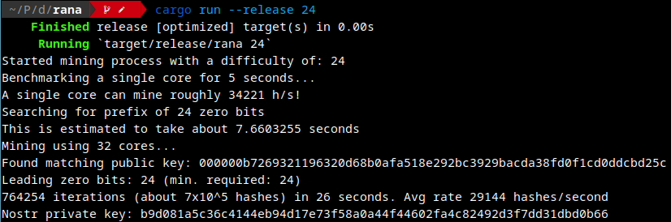

# Rana 🐸


Mine public keys that can be used with nostr.

This is based on [nip13](https://github.com/ok300/nostr-rs/blob/master/examples/nip13.rs) example.

Provide the desired difficulty as the last argument. See:



## Requirements:

0. You need Rust version 1.64 or higher to compile.

## Compile and execute it:

To compile on Ubuntu/Pop!\_OS/Debian, please install [cargo](https://www.rust-lang.org/tools/install), then run the following commands:

```
$ sudo apt update
$ sudo apt install -y cmake build-essential
```

Then clone the repo, build and run:

```bash
$ git clone https://github.com/grunch/rana.git
$ cd rana
$ cargo run --release
```

By default it will generate a public key with a difficulty of `10` but you can enter your difficulty as a parameter and be patient if you enter a bigger number.

```bash
$ cargo run --release 20
```
